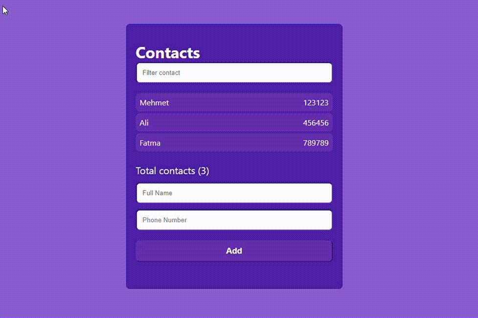

# Contacts App 
- Contact List with Reactjs

- <a href="https://nurayklc.github.io/contacts-app/">Click for Live Contacts App </a>

## Used Techs
- Reactjs
- HTML
- CSS 
- React Hooks 
- Github Pages 
- Source for [Github Pages](https://github.com/gitname/react-gh-pages)

## Run Project

In the project directory, you can run:

### `npm start`

Runs the app in the development mode.\
Open [http://localhost:3000](http://localhost:3000) to view it in your browser.

The page will reload when you make changes.\
You may also see any lint errors in the console.

## Contacts App Preview

